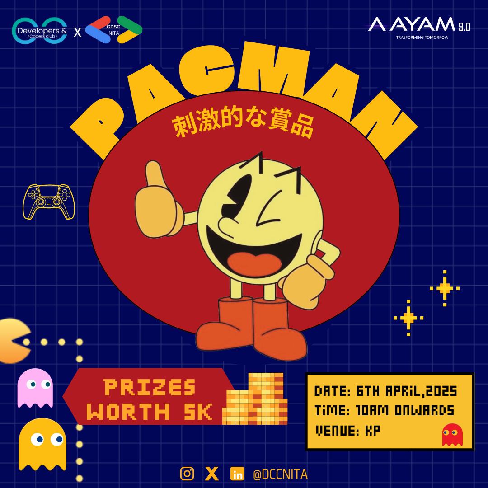

# DCC---Pacman



## Overview
DCC---Pacman is an engaging and interactive implementation of the classic Pacman game. This project is tailored for participants to test their skills and strategies while navigating Pacman through various challenges.

## Features
- Single and team modes (maximum 2 players).
- Progressive levels: Easy → Medium → Hard.
- Direction-based control using "U" (Up), "D" (Down), "L" (Left), "R" (Right).
- Memorize and input the path to guide Pacman.
- Multiple slots participation with unique time slots.
- Adheres to strict rules for fair play.
- **Link to Rulebook**: [RULEBOOK](https://drive.google.com/file/d/1dDWqcsoSb2fG08UHaoaJ6Xop6xaR9BlZ/view?usp=sharing)

## Getting Started

### Prerequisites
- Node.js (v14+ recommended)
- Git

### Installation
1. Clone the repository:
   ```bash
   git clone https://github.com/oohomohit/DCC---Pacman.git
   ```
2. Navigate to the project directory:
   ```bash
   cd DCC---Pacman
   ```
3. Install dependencies:
   ```bash
   npm install
   ```

### Running the Project
1. Start the development server:
   ```bash
   npm start
   ```
2. Open your browser and go to:
   ```
   http://localhost:8000
   ```

## How to Play
- Navigate the maze by typing:
  - "U" for Up
  - "D" for Down
  - "L" for Left
  - "R" for Right
- Progress through levels: Easy → Medium → Hard.
- Input a string of directions (e.g., "RLUD") to guide Pacman.
- Each participant can join multiple slots but not the same slot twice.
- Ensure adherence to rules to avoid disqualification.

## Tech Stack
- **Frontend**: React.js
- **Backend**: Express.js
- **Database**: MongoDB
- **Additional Tools**: Socket.IO

## License
This project is licensed under the [MIT License](./LICENSE).

## Contribution
Contributions are welcome! Please follow these steps:
1. Fork the repository.
2. Create a new branch:
   ```bash
   git checkout -b feature-name
   ```
3. Commit your changes:
   ```bash
   git commit -m "Add feature-name"
   ```
4. Push to your forked repository:
   ```bash
   git push origin feature-name
   ```
5. Create a pull request.

## Contact
For any inquiries or feedback, feel free to reach out:
- **Email**: [mohitpal180501@gmail.com](mailto:mohitpal180501@gmail.com)
- **GitHub**: [oohomohit](https://github.com/oohomohit)

---

Enjoy playing DCC---Pacman and may the best Pacman navigator win!
